# Food Scanner App in kotlin

A new Kotlin application.
#### Food Scanner App in kotlin usign openfoodfacts api

## Getting Started

This project is a starting point for a kotlin application.

#### Used features: 
- openfoodfacts food API [link](https://world.openfoodfacts.org/)
- kotlin navigation component
- google gson [link](https://github.com/google/gson) 
- retrofit http client [link](https://square.github.io/retrofit/)
- picasso images library [link](https://github.com/square/picasso)
- JakeWharton Kotlin Coroutine Adapter [link](https://github.com/JakeWharton/retrofit2-kotlin-coroutines-adapter)
- Barcode Scanner views based on ZXing and ZBar [link](https://github.com/dm77/barcodescanner)
- Kotlin Room database [link](https://developer.android.com/training/data-storage/room)

A few resources to get you started if this is your first kotlin project:
- [getting started with kotlin](https://kotlinlang.org/docs/tutorials/getting-started.html)
- [kotlin codelabs](https://codelabs.developers.google.com/android-kotlin-fundamentals/)

### App was created in kotlin language 

#### Used technology
- async tasks using coroutines
- build recyclerviews
- used arraylists and hashmaps
- used shared preferences
- custom classes 
- get api using retrofit
- usign jetpack navigation component
- usign room database
- usign viewmodels
- usign barcode scanner
- get permissions

## Screenshots :

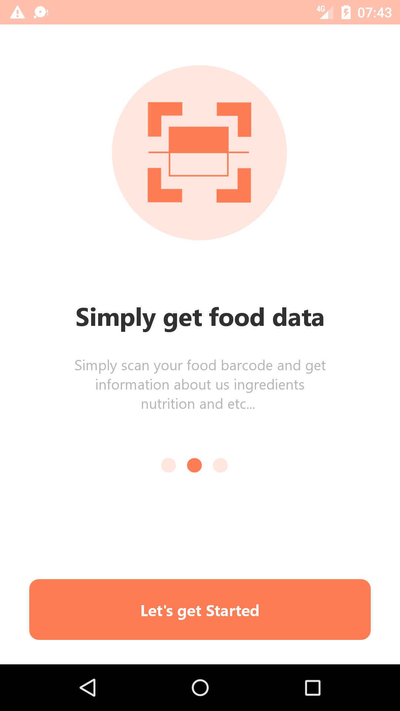
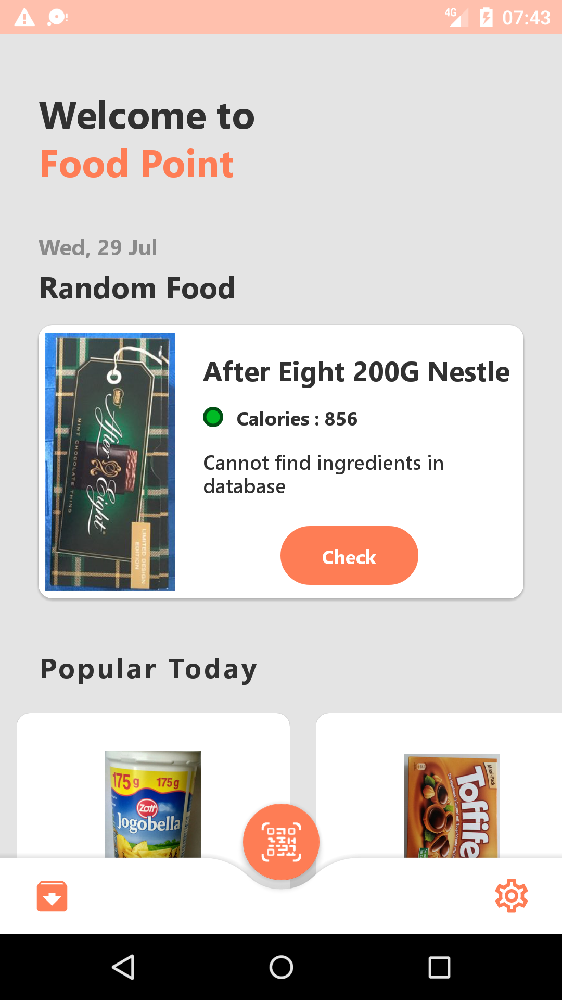

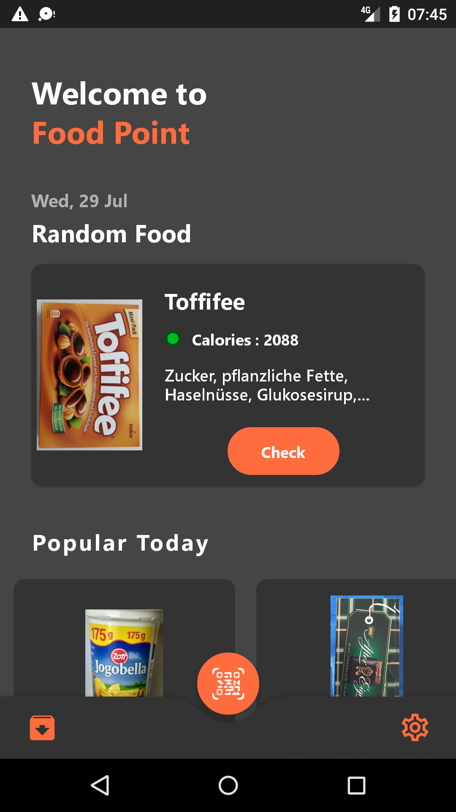
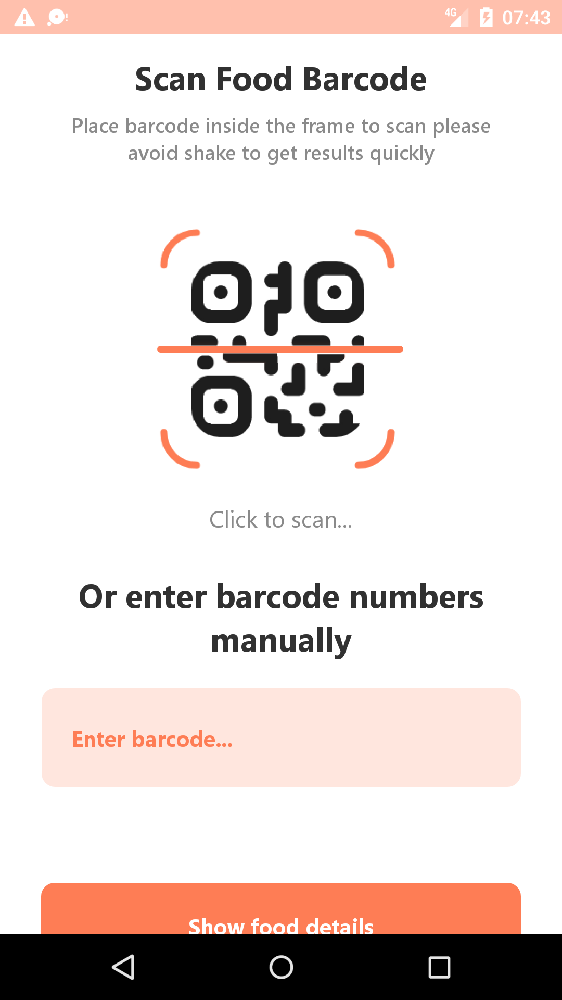
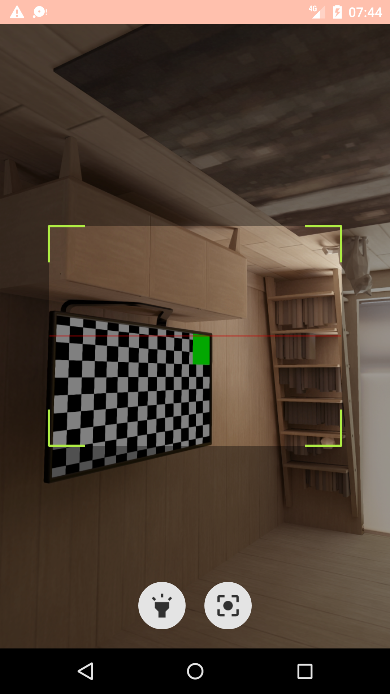
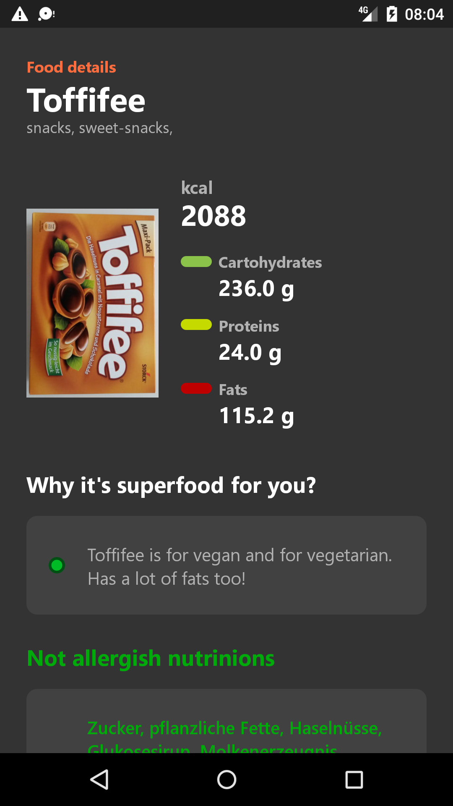
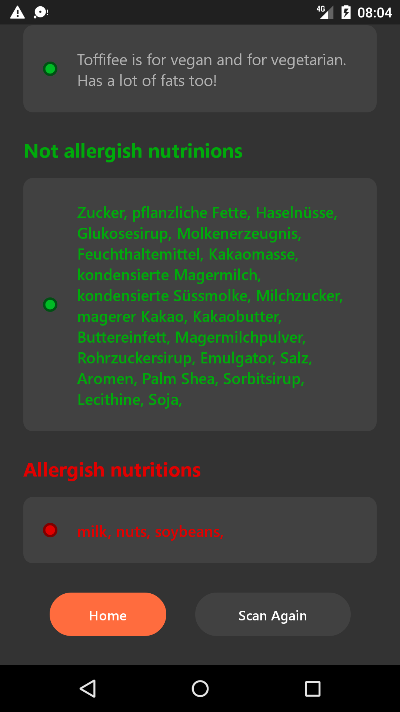
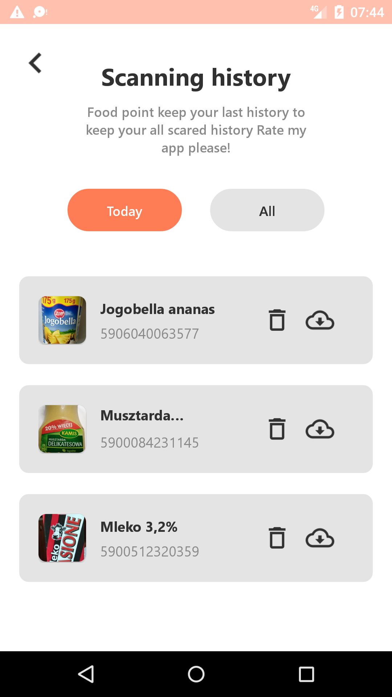
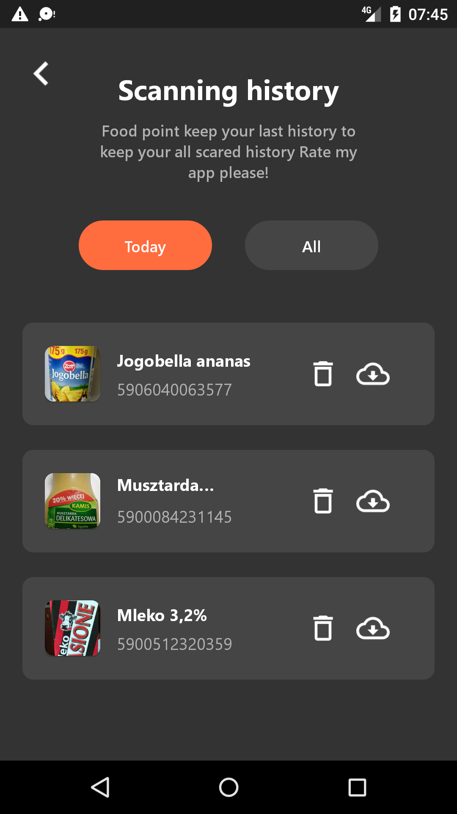
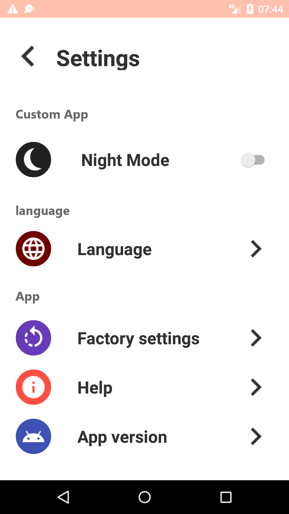
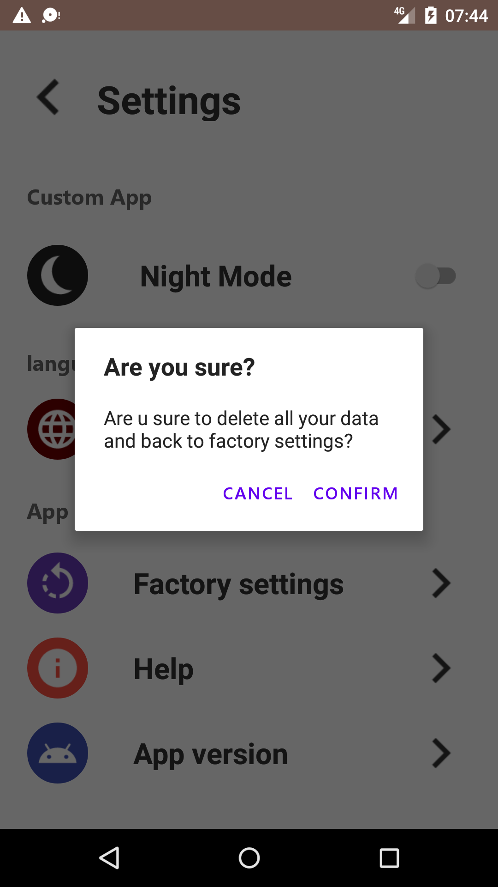
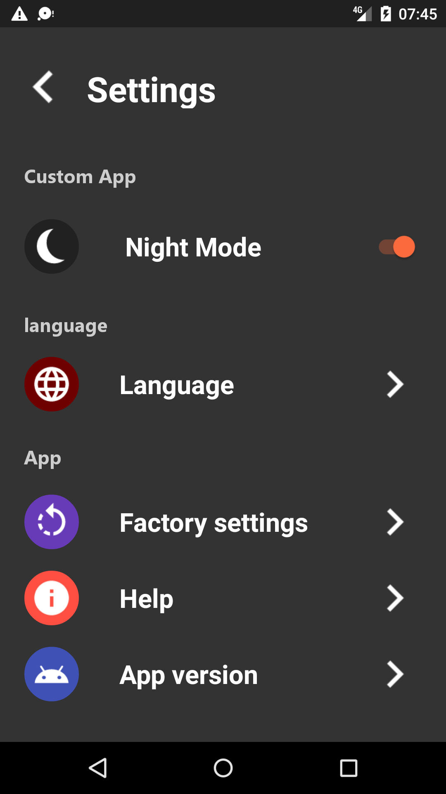

## Thanks for reading. Don't forget to star my project 
